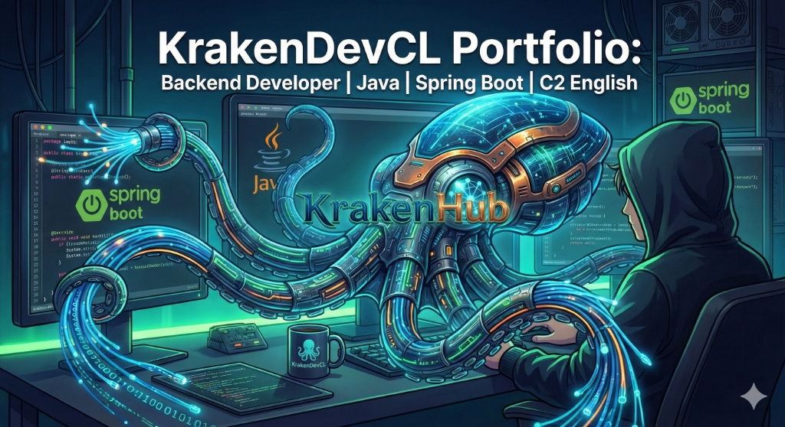

<div align="center">
  
  
  # 🌊 KrakenDevCL Portfolio
  
  ### Desarrollador de Software (Backend & Low-Code)
  
  [](https://krakendev-portfolio.vercel.app/)
  [](https://www.linkedin.com/in/josegallegoscarvallo/)
  [](mailto:krakendev.cl@gmail.com)

  *Backend Developer apasionado por la escalabilidad y la versatilidad técnica.*
</div>

---

## 🚀 Sobre el Proyecto

Este portafolio no es solo una vitrina de proyectos; es una aplicación moderna construida con **Next.js 15**, **React 19** y **Tailwind CSS**. Está diseñado para ofrecer una experiencia de usuario fluida y demostrar mis capacidades técnicas tanto en el frontend como en la arquitectura de sistemas.

### 🛠️ Tech Stack Principal

<div align="center">
  
  
  
  
  
  
</div >

---

## ✨ Características Destacadas

### 🤖 Integraciones con IA
- **Chatbot Asistente**: Un asistente virtual basado en **Google Gemini** que responde preguntas en tiempo real sobre mi experiencia y proyectos.
- **Generador de Introducciones**: Herramienta que utiliza IA para redactar mensajes de presentación personalizados basados en el perfil del empleador.

### 🔍 Optimización SEO (Vercel Ready)
- **Rastreo Óptimo**: `robots.txt` y `sitemap.xml` dinámico para una indexación perfecta en Google Search.
- **Social Metadata**: Configuración completa de **Open Graph** y **Twitter Cards**.
- **Rich Snippets**: Implementación de **JSON-LD (Schema.org)** para resultados enriquecidos de Persona y Sitio Web.

---

## 📁 Proyectos Principales

- **KrakenHub API**: Red social para desarrolladores (Spring Boot / Security / JPA).
- **Voll.med API**: Gestión clínica completa con seguridad JWT y Flyway.
- **Challenge Literalura**: Catálogo de libros integrando APIs externas y persistencia en DB.

---

## ⚙️ Instalación Local

Si deseas probar el proyecto en tu máquina:

1. **Clona el repositorio**:
   ```bash
   git clone https://github.com/KrakenDevCL/krakendev-portfolio
   ```

2. **Instala las dependencias**:
   ```bash
   npm install
   ```

3. **Variables de Entorno**:
   Configura tu archivo `.env` con las API keys de Google GenAI y Resend.

4. **Inicia el servidor**:
   ```bash
   npm run dev
   ```

---

<div align="center">
  Desarrollado por <b>KrakenDevCL</b>
</div>
